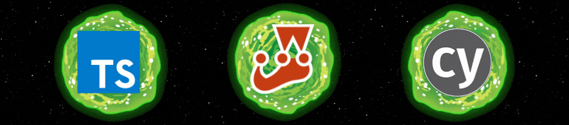
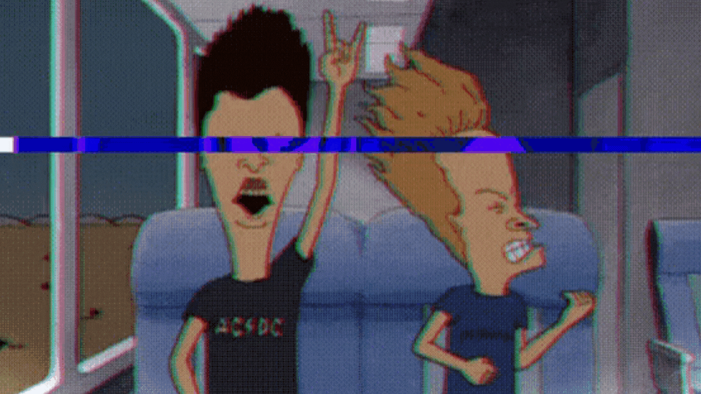

# 

- :rocket:  Full Stack Developer in training 
- :books:  Mechanical Engineering student 
- :guitar:  Heavy metal fan 
- :eyes:  Anime friendly 
- :video_game:  Gamer 
- :seedling:  I’m currently learning Typescript 
- :thought_balloon:  I love hearing about things I don't know 
- :dog2:  Fun fact: I love pets 

 

# 

  
<b>:trophy: &nbsp;Main</b>

     
      
     

  
<b>:writing_hand: &nbsp;Working on</b>

     
      
     

# 

## 

